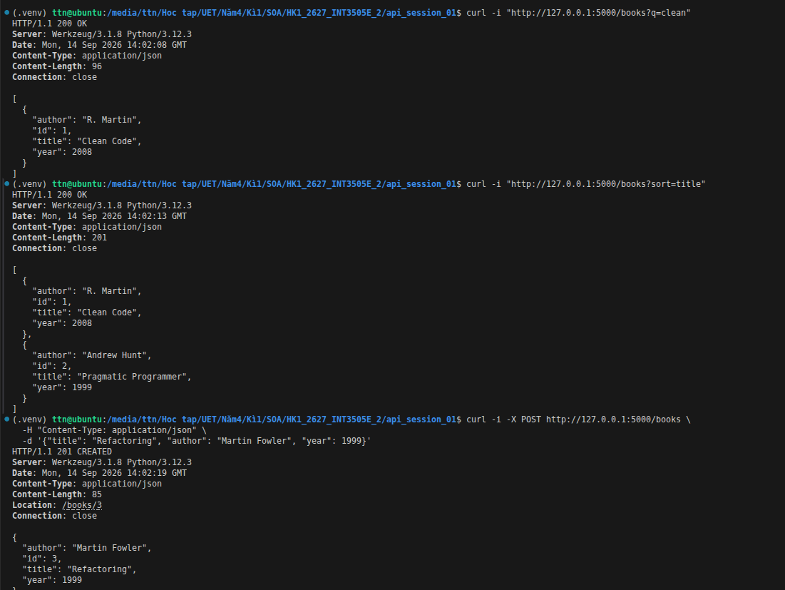
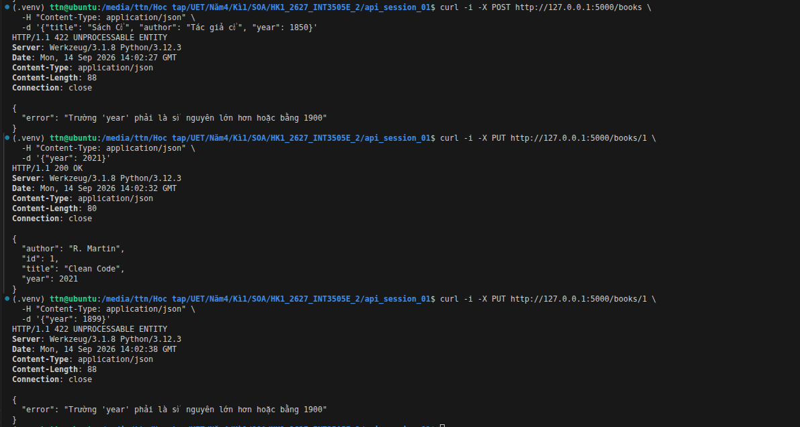

## BÀI 1: PHÂN TÍCH 3 PUBLIC API THỰC TẾ

### 1. GitHub REST API
* **Domain:** Quản lý mã nguồn & Phát triển phần mềm
* **Loại architectural:** REST API
* **Base URL:** `https://api.github.com`
* **Authentication Method:**
  * **Unauthenticated:** Cho phép gửi request đọc dữ liệu công khai (giới hạn Rate Limit: 60 request/giờ).
  * **Authenticated:** Bắt buộc dùng **Personal Access Token (PAT)** hoặc **OAuth 2.0** truyền qua Header: `Authorization: Bearer <TOKEN>` (giới hạn Rate Limit: 5,000 request/giờ).
* **Versioning:** 
  * Sử dụng **Header-based versioning**: `X-GitHub-Api-Version: 2022-11-28`.
  * Trước đây sử dụng URL path prefix (`/v3`).
* **Resource Identifier:** 
  * Sử dụng kết hợp **String/Slug** (ví dụ: `/repos/{owner}/{repo}`) và **Số nguyên (Integer ID)** (ví dụ: `issue_number`, `user_id = 583231`).

---

### 2. Spotify Web API
* **Domain:** Âm nhạc & Giải trí đa phương tiện
* **Loại architectural:** REST API
* **Base URL:** `https://api.spotify.com/v1`
* **Authentication Method:**
  * Bắt buộc xác thực bằng **OAuth 2.0** (Client Credentials Flow hoặc Authorization Code Flow).
  * Truyền Access Token qua Header: `Authorization: Bearer <access_token>`.
* **Versioning:** **URL Path Versioning** (được nhúng trực tiếp vào Base URL: `/v1`).
* **Resource Identifier:**
  * Sử dụng **Base62 Alphanumeric String (22 ký tự)** độc quyền của Spotify (ví dụ Track ID: `4iV5W9uYEdYUVa79Axb707`).

---

### 3. ExchangeRate-API
* **Domain:** Tài chính & Tỷ giá hối đoái
* **Loại architectural:** REST API
* **Base URL:** `https://v6.exchangerate-api.com/v6/{YOUR-API-KEY}`
* **Authentication Method:**
  * Sử dụng **API Key** được nhúng trực tiếp trong URL Path (`/v6/{YOUR-API-KEY}`).
* **Versioning:** **URL Path Versioning** (`/v6`).
* **Resource Identifier:**
  * Sử dụng **Mã tiền tệ ISO 4217 (Chuỗi 3 ký tự)** làm định danh tài nguyên (ví dụ: `USD`, `EUR`, `VND`).

---

## BÀI 2: PHÂN TÍCH LÝ THUYẾT & SO SÁNH (Geewax Ch.1 & Higginbotham Ch.1)

### 1. Khái niệm Cốt lõi
* **API (Application Programming Interface):** Là giao diện / hợp đồng (contract) được định nghĩa rõ ràng, cho phép các phần mềm tương tác và trao đổi dữ liệu/tính năng với nhau mà không cần quan tâm đến chi tiết cài đặt bên trong (implementation details).
* **Resource (Tài nguyên):** Là một thực thể dữ liệu hoặc khái niệm trung tâm mà API thao tác (ví dụ: `User`, `Book`, `Order`). Mỗi tài nguyên được định danh duy nhất thông qua một URI.

---

### 2. So sánh 5 đặc điểm API tốt (Slide 05 vs. Geewax & Higginbotham)

| Tiêu chí | 5 Đặc điểm API tốt (Slide 05) | Điểm bổ sung nổi bật từ Geewax & Higginbotham |
| :--- | :--- | :--- |
| **1. Tính đơn giản** | Đơn giản, dễ hiểu, dễ tích hợp. | **Developer Experience (DX) là mục tiêu cốt lõi:** Higginbotham nhấn mạnh API là một "sản phẩm" phục vụ lập trình viên. DX đòi hỏi tính dễ đoán (predictability), khả năng tự khám phá (self-discoverability) và giảm thiểu tải trí óc (cognitive load). |
| **2. Tính nhất quán** | Chuẩn hóa Naming, URL, HTTP Methods & Status Codes. | **Chuẩn hóa các Design Patterns tương tác:** Geewax bổ sung việc nhất quán không chỉ ở cách đặt tên mà ở cấu trúc của toàn bộ thao tác phụ: Phân trang (`page_token`), Lọc (`filter`), Sắp xếp (`sort`), và Custom Methods (`:archive`). |
| **3. Tính tin cậy** | Hoạt động ổn định, có cơ chế xử lý lỗi rõ ràng. | **Thông điệp lỗi có tính chỉ dẫn hành động (Actionable Errors):** Higginbotham chỉ ra rằng lỗi trả về không được dừng lại ở Status Code (`400`, `500`) mà phải chứa cấu trúc dữ liệu mô tả rõ: trường dữ liệu sai, lý do sai và liên kết hướng dẫn sửa. |
| **4. Khả năng mở rộng** | Chịu tải tốt (Scalability) và tiến hóa tốt. | **Khả năng tiến hóa không gây phá vỡ (Backward Compatibility / Evolvability):** Geewax đưa ra nguyên tắc: "Chỉ thêm, không xóa hoặc đổi nghĩa trường cũ". Nâng cấp API phải đảm bảo các client cũ không bị hỏng (non-breaking changes). |
| **5. Tính bảo mật** | Bắt buộc xác thực (AuthN) và phân quyền (AuthZ) an toàn. | **Mô hình hóa tài nguyên theo nghiệp vụ (Domain-Driven):** Cả hai tác giả lưu ý không được bê nguyên cấu trúc Database ra làm API (Database-as-an-API anti-pattern). API phải được thiết kế theo Use-case và luồng nghiệp vụ thực tế. |

### 3.Kết quả bài 3

---
