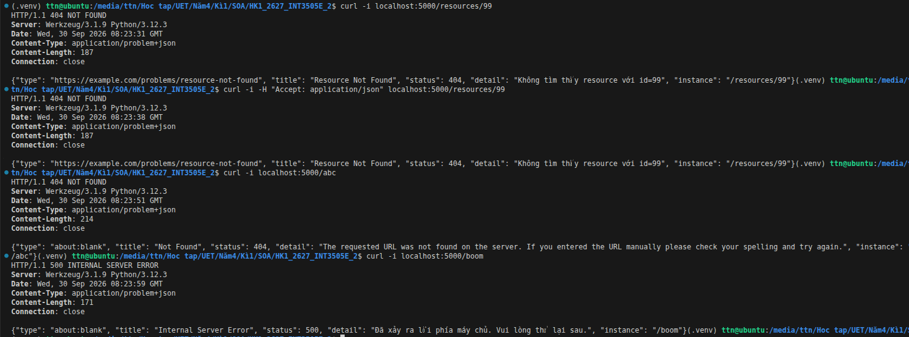

Mô tả:

1. curl -i localhost:5000/resources/99: resource không tồn tại, trả 404 problem+json đủ 5 trường.
2. curl -i -H "Accept: application/json" localhost:5000/resources/99: gửi Accept JSON, vẫn trả problem+json.
3. curl -i localhost:5000/abc: route không tồn tại, HTTPException trả 404 problem+json.
4. curl -i localhost:5000/boom: exception chưa bắt, trả 500 trung tính, không lộ stack trace.

Kết quả gọi api

